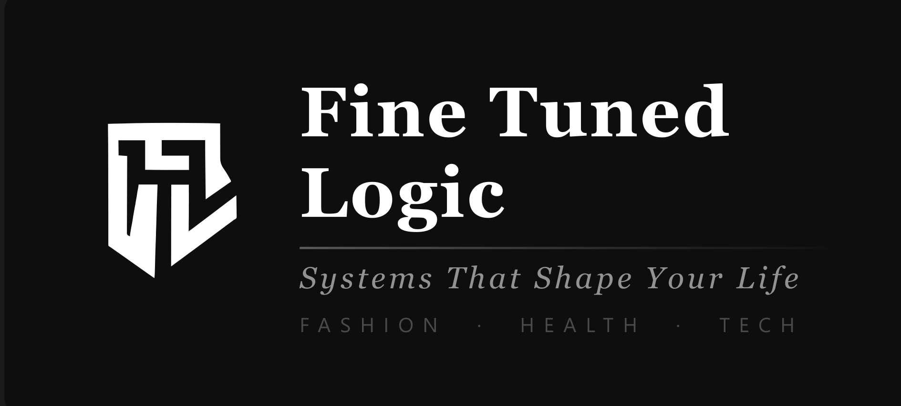

<h1 align="center">Hi, I'm Tasneem Mahomed </h1>

<p align="center">
  
</p>
<p align="center">
  <em>Fashion &nbsp;•&nbsp; Health &nbsp;•&nbsp; Tech</em>
</p>

<p align="center">
  
  
  
  
  
  
</p>

<p align="center">
  <a href="https://www.linkedin.com/in/tasneemmahomed">
    
  </a>
  <a href="mailto:ftlcollectivejhb@gmail.com">
    
  </a>
  
</p>

---

## 👩‍💻 About Me

I'm a **multidisciplinary technologist** and full-stack developer operating at the intersection of **software development, cybersecurity, design, health, and social impact**. I am the founder of **Fine Tuned Logic** — a brand built on the belief that the systems we interact with daily, whether digital, physical, or human, should be finely tuned to genuinely shape and improve lives.

My approach to technology is grounded in three pillars: **Fashion. Health. Tech.** These aren't separate interests — they are lenses through which I design, build, and advocate.

What sets me apart isn't just what I know — it's how I operate. **I actively throw myself into things I have zero expertise in.** I don't wait for permission or perfect conditions. I pick something that intimidates me, I start, I figure it out, and I iterate. That's not recklessness — it's a methodology. Every skill I have came from deciding to do something before I was ready.

I love **constructive criticism**. Tell me what's wrong with my work. It's the fastest way I learn and the only way anything gets better. I don't take it personally — I take notes.

> *"Technology should empower people, improve access to information, and protect vulnerable communities. I build with that in mind."*

---

## 🔭 Currently Active — Learning in Public

```text
🔐 Cybersecurity        ████████░░░░  Foundations — data protection, secure design
🌐 API Systems          ██████░░░░░░  Architecture, integration, REST & beyond
🤖 AI & Machine Learning████████░░░░  Prompt engineering, AI tools, model workflows
⚛️  React / Node.js     ████████░░░░  Refining through project builds
🖨️  CAD / 3D Printing   ██████████░░  Applied in real industrial work
```

> Projects for all of the above are being actively built and will be pushed to this repo as they are completed. Watch this space.

---

## 🛠️ Skills & What I Do

### Development


### Cybersecurity *(Active Study)*


### API & AI *(Active Study)*


### Social Media, Content & Marketing


### Design & Fabrication


### Tools & Platforms


---

## 🚀 Projects

> Projects are actively being built across all areas of study and practice. Each one will be documented and pushed to this repo as it's completed — code, process notes, and all the learning that happened along the way. Come back and watch this grow.

*Ongoing areas: full-stack web apps · cybersecurity demos · API integrations · AI workflow tools · design & brand projects · CAD/3D documentation*

---

## 💜 Advocacy & Social Impact

Fine Tuned Logic exists to build systems that serve people — not just products.

| Area | What I Do |
|---|---|
| &#x1F489; Women's Health | Qualified Women's Health Practitioner — education and awareness |
| &#x1F9E0; Mental Health | Open conversations, digital support, destigmatisation |
| &#x1F6E1;&#xFE0F; GBV Prevention | Tech-based safety solutions and community advocacy |
| &#x1F457; Fashion Empowerment | Free online fashion classes for women in need |
| &#x1F331; Special Needs Education | Founded NPO to teach digital skills to special needs children |
| &#x1F4BB; Women in Tech & STEM | Actively advocate for women entering and staying in tech and STEM — visibility, access, and representation matter |

---

## 🎓 Education & Qualifications

| Full Stack Development |
| AI Training *(In Progress)* | Active study |
| API Systems *(In Progress)* | Self-directed |
| Cybersecurity *(In Progress)* | 
| Web Development | 
| TEFL / TESOL |
| Graphic Design | 
| Fashion Design |
| Matric | 

---

## 🌱 How I Work

I don't wait until I'm ready. I've never waited until I was ready. I find something I don't know how to do, decide I'm doing it anyway, and I figure it out. That approach has given me a skillset that crosses development, design, fabrication, marketing, advocacy, and education — because none of those were handed to me. I went and got them.

If you're working with me and you see something I could do better — **say it**. Constructive criticism is not a threat to me, it's information. I'd rather hear the hard thing and improve than be handled carefully and stagnate.

> *Always learning. Ever evolving. Fine tuned by every project.*

---

## 📫 Let's Connect

<p align="center">
  <a href="https://www.linkedin.com/in/tasneemmahomed">
    
  </a>
  <a href="mailto:ftlcollectivejhb@gmail.com">
    
  </a>
</p>

---

<p align="center">
  <b>Fine Tuned Logic</b><br/>
  <em>Systems That Shape Your Life</em><br/>
  Fashion &nbsp;•&nbsp; Health &nbsp;•&nbsp; Tech<br/><br/>
  📍 Johannesburg, South Africa
</p>
